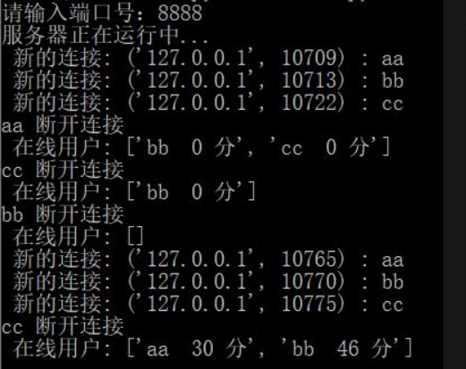
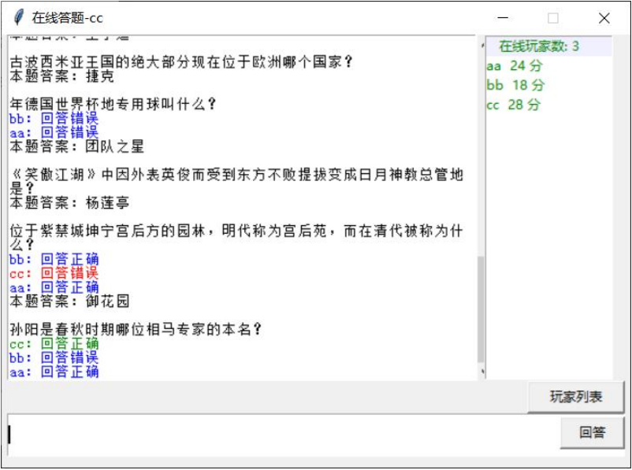

# 多人在线知识竞答系统

这是大二下学期学习计算机网络时的一个简单实验，使用 python 和 mysql 数据库实现了一个简单的、C/S结构的在线知识抢答小游戏。

玩家通过客户端连接到服务器，可以在规定时间内对服务器定时发出的问题进行回答，按照回答正确的顺序给予响应玩家积分，可多次回答，注意答错扣分。

---

## 模块介绍

#### 服务器端

* Server.py 文件通过一个服务器类实现客户端和服务器端的 TCP 连接，并包括存储在线用户信息，发布问题和上一题答案，判断客户端发来的答案正误，将判断结果发送给所有用户，统计用户得分，更新得分表后向所有用户发送刷新等功能。

#### 客户端

* Client.py 文件使用 python 自带的 tkinter 包制作了一个简单的用户图形界面，对服务器发来的不同类型信息进行分色显示，并可以显示用户得分表。

#### 数据库

* Answer.py 使用 pymysql 软件包可以很方便的实现服务器和数据库的连接，这部分包括随机从数据库获取题目、检查答案是否正确、返回公布答案等功能。

* question.sql 是数据库的初始化数据，存储了一些问题和答案，可以在数据库中创建一个新的数据表，并将初始化数据插入到数据表中。

## 运行截图

####  服务器

#### 客户端

